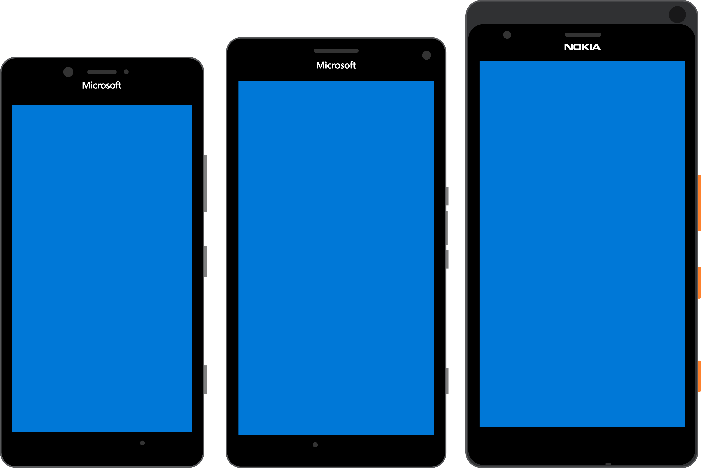

# Microsoft Mobile ARM64 Windows Driver pack
## For Lumia 950 (incomplete), Lumia 950 XL, RX-130/id330-1 (EB0.X/EB1.X/EB2.X)

This pack is a work in progress and may be getting updates at a later time.

If you are deploying this driver pack using WOA Deployer for Lumia, make sure WOA Deployer version is greater or equal than 2.6.

## Copyright, License, Disclaimers and end of user license agreement

**Below notice must be present in all redistributed portions of this software**

- By installing this driver pack, you agree that any damage done to your phone or any loss of data is your entire responsibility and we cannot be taken responsible for data loss if it ever happens. We believe however this driver pack is safe to install. Try at your own risk!

- Charging an extra fee for a phone where you would have installed those drivers and you are selling online or to users is immoral and illegal due to where those drivers come from. An end user may not know how to update their system in the future and will most likely spent a lot more than what it should have for a driver pack he can find for free online. Selling a device with an extra fee also ruins the work of others that worked on this project. While we can't enforce this policy, we decided to put this notice here in the hopes of some people understanding the morality of this.

**Contributors**

We would like to thank the following people that helped:

- ADeltaX
- Googulator
- gus33000
- imbushuo
- @never_released
- Heathcliff74 for WPInternals
- Our friends in China that worked hard to bring the Hapanero ARM64 firmware into the public
  and that provided test hardware for us.
- Our testers, you know who you are :)
- The Windows RT Lumia projects
- Qualcomm and Microsoft
- and many other friends and contacts which would be too long to list here

The above copyright notice and this permission notice shall be included in all
copies or substantial portions of the Software.

THE SOFTWARE IS PROVIDED "AS IS", WITHOUT WARRANTY OF ANY KIND, EXPRESS OR
IMPLIED, INCLUDING BUT NOT LIMITED TO THE WARRANTIES OF MERCHANTABILITY,
FITNESS FOR A PARTICULAR PURPOSE AND NONINFRINGEMENT. IN NO EVENT SHALL THE
AUTHORS OR COPYRIGHT HOLDERS BE LIABLE FOR ANY CLAIM, DAMAGES OR OTHER
LIABILITY, WHETHER IN AN ACTION OF CONTRACT, TORT OR OTHERWISE, ARISING FROM,
OUT OF OR IN CONNECTION WITH THE SOFTWARE OR THE USE OR OTHER DEALINGS IN THE
SOFTWARE.

## Project Status

The following items are not functional yet on specific devices, reason when available is specified:

Hapanero (Any revision):

- Fingerprint reader (missing drivers)
- Cameras (missing drivers)
- Any kind of sensor (except ALS)
- Audio volume control for Speakers (stuck at 100%)
- Vibration motor
- x86 DirectX support is missing.
- FM Radio

Cityman:

- Iris biometric sensor (missing drivers)
- Cameras (missing drivers)
- Any kind of sensor (except ALS)
- Audio volume control for Speakers (stuck at 100%)
- Vibration motor
- HDMI out via USB-C
- x86 DirectX support is missing.
- FM Radio

Talkman:

- PEP (root cause of every difference with other devices right now)
- GPU
- Iris biometric sensor (missing drivers)
- Cameras (missing drivers)
- Any kind of sensor (except ALS)
- Audio
- Microphones
- Vibration motor
- WLAN (requires PEP)
- HDMI out via USB-C
- Cellular
- FM Radio

## Readme

### Packages

Refer to https://github.com/WOA-Project/MSM8994-8992-NT-ARM64-Drivers/wiki/Installing-drivers-manually.

### Notes

- To install drivers, you'll need to follow the usual Dism procedure before first boot of the operating system.
  ie: Dism /Image:DriveLetterOfOS /Add-Driver /Driver:PathToDeviceFolder\Pre-OOBE /Recurse
  nointegritychecks and testsigning must be enabled in the OSLoader entry in BCD for the operating system
  
## Cellular disclaimers

We've also been telling people on engineering devices to make backups, this is especially true here.
Flashing an entire eMMC img on engineering devices will not only risk you damaging the device, but you will also lose for *ever* the modem partitions for *your* phone.
Those are unique, there's ways to recover them but it's borderline legal. If you do not have the correct modem partitions for your device, you will *never* get Cellular to work on your device.
You have been warned.

## USB Debugging

- It is advised to not install LumiaUSBKm when using USB debugging (it is under Device Specifics/DeviceName/USB)
- In order to enable USB debugging, you must have your phone put in mass storage mode and have access to the WoA ESP desktop
  partition.
  You need to go to /EFI/Microsoft/Boot/ (there you'll find a BCD file)
  Run the following commands from a command prompt running as administrator inside that directory:
  
  bcdedit /store BCD /dbgsettings usb TARGETNAME:WOATARGET
  bcdedit /store BCD /set {default} debug on

## Hapanero setup

It is highly recommended you do not install the leaked ARM64 firmware on Hapanero devices. This firmware is really buggy and is prone to lots of overheating problems and may ultimately damage your device.
Instead, please install Lumia950XLPkg like on Citymans and Talkmans, on a RnD firmware specifically made for Hapanero (like 10586, 10240) and use the Hapanero2 drivers.

On Hapanero pre-EB2 devices, you'll currently have to use the leaked ARM64 firmware. The ARM64 Windows 10 Mobile present will not boot, and will crash in qcsubsys.
